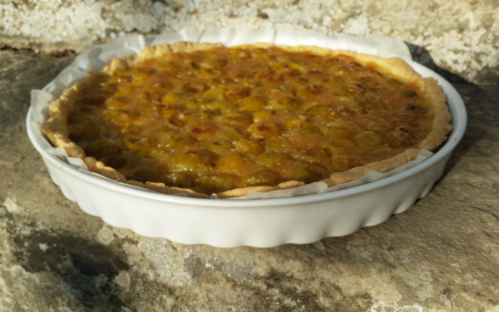

# Tarte aux mirabelles

## Temps

* Préparation : 45 min (c'est long de dénoyauter les mirabelles)
* Cuisson : 45 min

## Pour la pâte brisée

### Ingrédients
* 300 g de farine
* 150 g de beurre en dés tiédis pour avoir une texture "pommade"
* 1/2 cuillère à café de sel
* 3 cuillères à soupe de sucre (pâte ici sucrée)
* 8 cl d'eau

### Instructions
* Mélanger farine + sel + sucre
* Incorporer le beurre pour obtenir une texture sablée
* Lier la pâte en ajoutant l'eau et faire une boule
* Etaler au rouleau / fariner et placer dans le moule huilé

## Pour l'appareil

### Ingrédients
* 750 g de mirabelle dénoyautées
* 50 g de beurre
* 100 g de sucre en poudre
* 1 oeuf 

### Instructions
* Piquer la pâte
* Disposer les mirabelles
* Faire fondre beurre + sucre à feu doux
* Ajouter l'oeuf et mélanger
* Verser sur les mirabelles
* Faire cuire au four à thermostat 5/6 (170°C) pendant 45 mn

