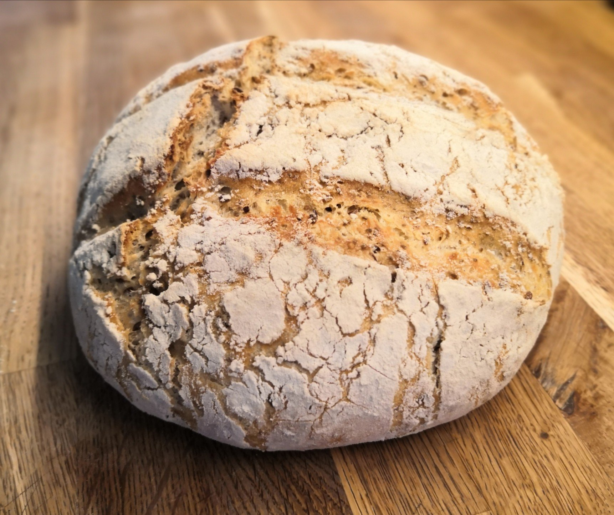
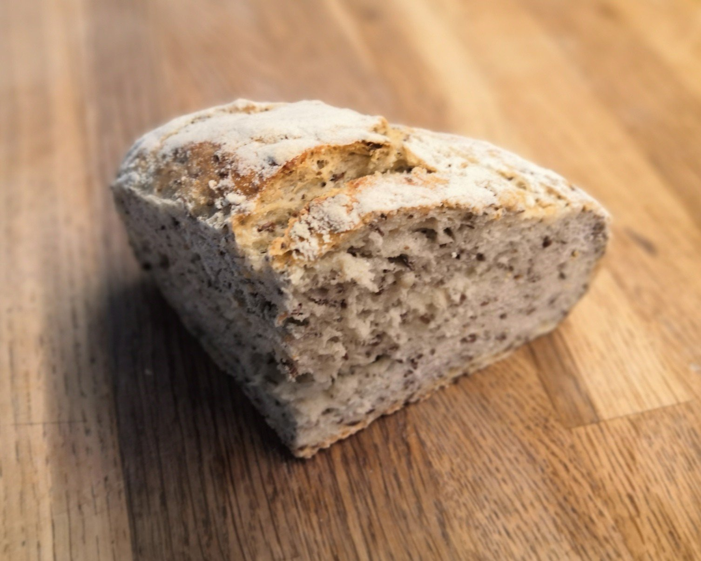
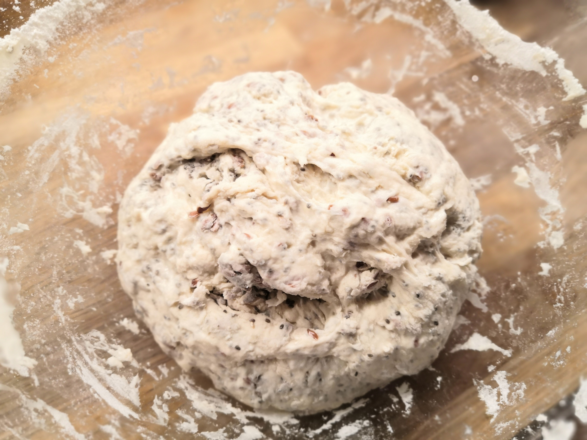
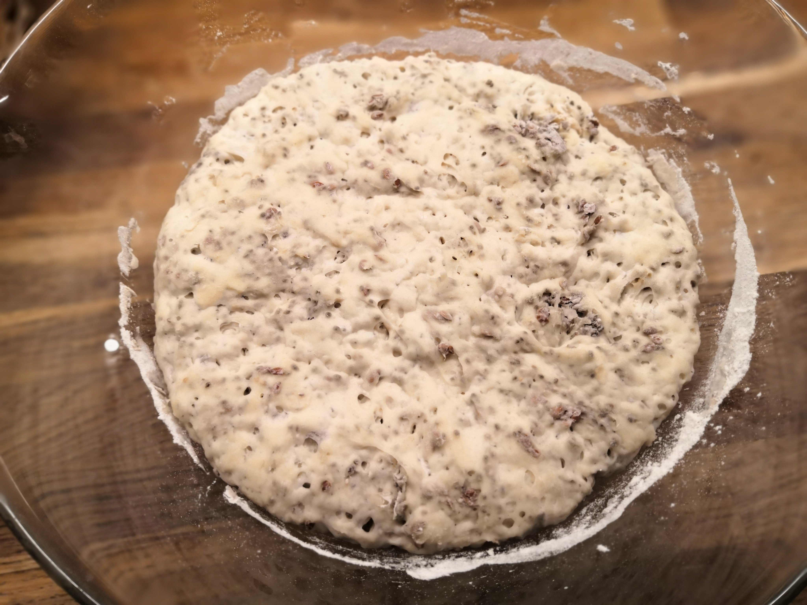
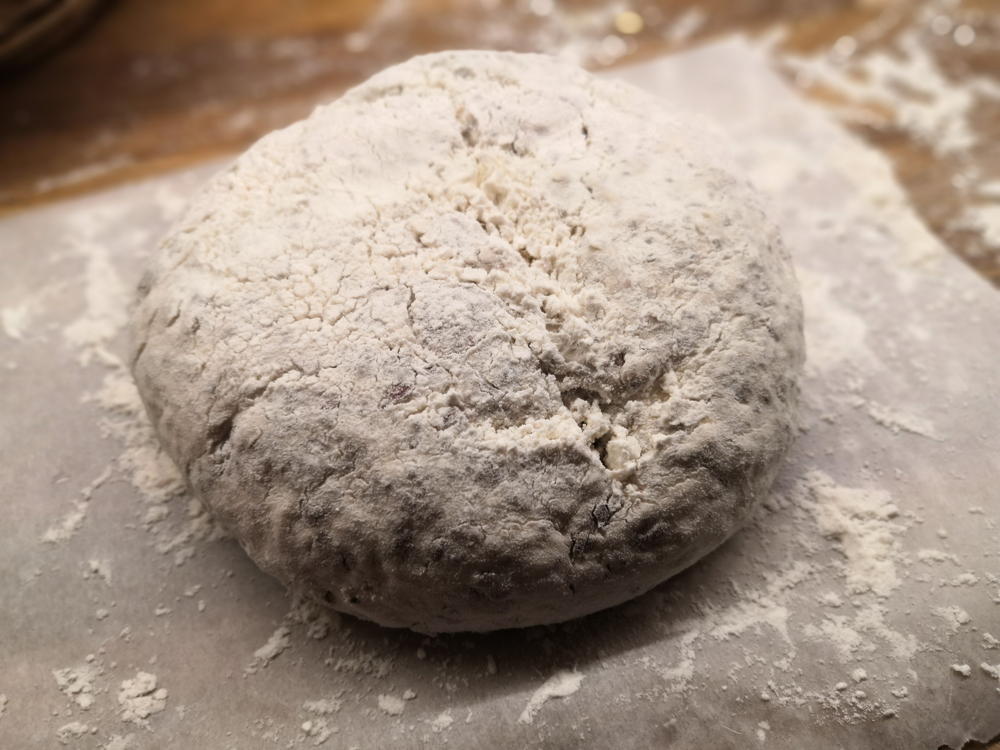

# Pain à la cocotte

## En bref

Un pain de campagne facile à préparer qui se conserve plusieurs jours
dans un torchon voire plusieurs semaines au congélateur (pré-tranché).

## Temps

* Préparation : 15 min
* Repos pour que la pâte lève : 8h, voire la nuit entière pour le
  lendemain matin
* Cuisson : 45 min

## Ingrédients

Pour 1 pain :

* 600g farine T65
* 450ml d'eau
* 1 sachet levure boulangère
* 2 cuillières à café rases de sel
* 100g graines mélangées selon vos goûts (sésame, pavot, tournesol,
  courge, lin, etc.)

## Ustensile

* Une cocotte en fonte avec couvercle (qui ira au four à 240°C)

## Préparation

* Tout mélanger dans grande jatte jusqu'à avoir une pâte collante

* Poser un torchon propre sur la jatte et laisser reposer 8h (voire la
  nuit entière), idéalement autour de à 22-23° (ex : à côté du
  radiateur)
  

  
* Travailler sur farine -> boule sèche (environ 1 min)
* Poser sur papier sulfurisé fariné
* Laisser reposer 1h

* Découper le papier autour du pain
* Entailler la boule au couteau dentelé pour éviter que le pain ne craque
* Sortir la cocotte en fonte du four à 245°C
* Poser le pain au fond de la cocotte (sans se brûler)
* Mettre le couvercle et mettre au four 22 min à 245°C
* Enlever le couvercle et remettre au four 22 min à 245°C
* Sortir la cocotte du four, puis le pain de la cocotte et le laisser
  refroidir (plusieurs heures), sur une grille froide par exemple

## Conclusion

Le résultat est assez bluffant mais, au prochain essai, je vais tenter :

* d'ajouter une 3e cuiller à café rase de sel
* de pétrir plus longtemps pour mieux homogénéiser la mie
* de cuire à 250°C

## Références

* [Popote & potager](https://www.youtube.com/watch?v=8WIQKFYTnzA)

