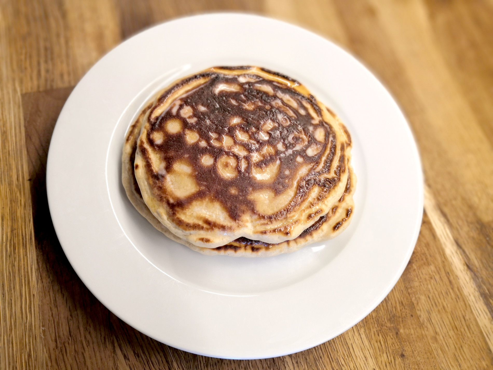

# Pancakes

## En bref

Des pancakes pour le petit déjeuner du week-end.

## Temps

* Préparation : 10 min
* Cuisson : 5 min

## Ingrédients

Pour 4 gros pancakes :

* 200g farine T80
* 1 sachet levure chimique
* 2 oeufs
* lait
* beurre (salé de préférence)
* 1 pincée de sel
* [option] une poignée de raisins secs
* Sirop d'érable

## Ustensiles

* Une jatte
* Une louche
* Une crêpière
* Une spatule

## Préparation

* Mélanger les poudres dans grande jatte
* Ajouter l'oeuf puis du lait jusqu'à avoir une pâte visqueuse mais pas trop liquide
* Beurrer la crêpière
* Verser une louche sur la crêpière
* Quand la pâte est dorée en dessous (vérifier avec la spatule), retourner
* Beurrer le pancake et, quand il est cuit, le déposer sur une assiette
* Reproduire l'opération jusqu'à épuisement de la pâte (4 grosses louches ou plus si les louches sont plus petites)
* Servir avec le sirop d'érable

