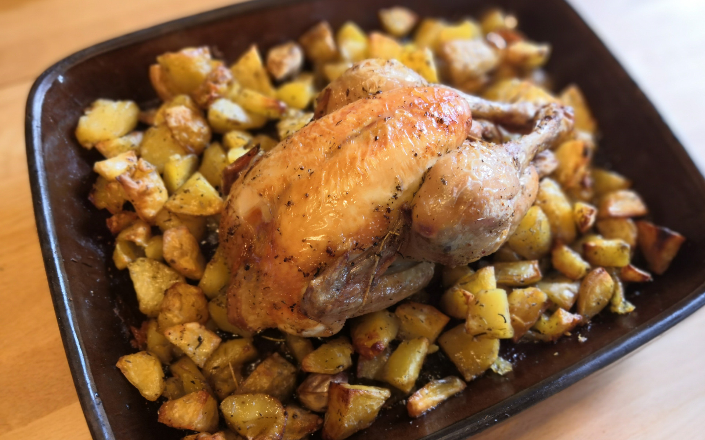

# Poulet rôti et pommes de terres

## Temps

* Préparation : 15 min
* Cuisson : 1h15

## Matériel

* Un four
* Un grand plat qui va au four

## Ingrédients

Pour 4 personnes:

* Un poulet
* 1kg de pommes de terre
* Herbes de Provence
* Sel
* Poivre
* Huile

## Préparation

* Poser le poulet au centre du plat
* Eplucher puis laver les pommes de terre (si elles sont grosses, les
  couper en 8)
* Préchauffer le four à 230°C, chaleur tournante
* Mettre les pommes de terre dans le plat autour du poulet
* Avec les doigts, massez le poulet et les pommes de terre avec huile,
  sel, poivre, herbes de Provence
* Ajouter 1/2 verre d'eau
* [option] Mettre 5 gousses d'ail en chemise
* [option] Verser un peu de vinaigre de vin ou de cidre sur le poulet
  (il paraît que cela rend la peau plus croustillante, je n'ai pas
  fait l'essai randomisé contrôlé en double aveugle pour m'en assurer)
* Enfourner et faire cuire 1h15 (230°C, chaleur tournante) en
  retournant le poulet pour qu'il dore et en en profitant pour
  mélanger les pommes de terre (disons 20 min recto, 20 min verso, 15
  min de chaque côté, 5 min recto pour finir)

## Références

Recette inspirée de :
* [Marmiton](https://www.marmiton.org/recettes/recette_poulet-roti-et-ses-pommes-de-terre_43958.aspx)

